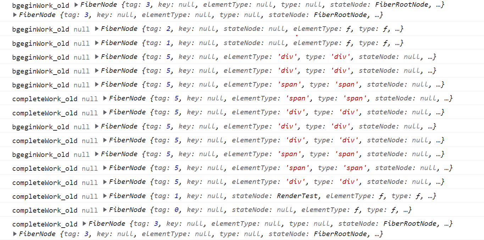

###  React 理念
---    
####  用 JavaScript 构建快速响应的大型 Web 应用程序   
制约快速响应的因素   
我们日常使用App，浏览网页时，有两类场景会制约快速响应：   
1. 当遇到大计算量的操作或者设备性能不足使页面掉帧，导致卡顿。   
2. 发送网络请求后，由于需要等待数据返回才能进一步操作导致不能快速响应。     

这两类场景可以概括为：       
1. **CPU的瓶颈**      

    主流浏览器刷新频率为60Hz，即每（1000ms / 60Hz）16.6ms浏览器刷新一次。    
    我们知道，JS可以操作DOM，GUI渲染线程与JS线程是互斥的。所以JS脚本执行和浏览器布局、绘制不能同时执行。    
    在每16.6ms时间内，需要完成如下工作：   
    JS脚本执行 => 样式布局 => 样式绘制    
    当JS执行时间过长，超出了16.6ms，这次刷新就没有时间执行样式布局和样式绘制了。     
    JS脚本执行时间过长，页面掉帧，造成卡顿。     

    如何解决这个问题呢？    
    答案是：在浏览器每一帧的时间中，预留一些时间给JS线程，React利用这部分时间更新组件（可以看到，在源码  中，预留的初始时间是5ms）。       
    
    当预留的时间不够用时，React将线程控制权交还给浏览器使其有时间渲染UI，React则等待下一帧时间到来继续被中断的工作。      

    这种将长任务分拆到每一帧中，像蚂蚁搬家一样一次执行一小段任务的操作，被称为时间切片（time slice）       
    **解决CPU瓶颈的关键是实现时间切片，而时间切片的关键是：将同步的更新变为可中断的异步更新。**       

2. **IO的瓶颈**    

    网络延迟是前端开发者无法解决的。如何在网络延迟客观存在的情况下，减少用户对网络延迟的感知？     
    先在当前页面停留了一小段时间，这一小段时间被用来请求数据。       
    当“这一小段时间”足够短时，用户是无感知的。如果请求时间超过一个范围，再显示loading的效果


#### React15架构     
---   
1. Reconciler（协调器）—— 负责找出变化的组件      
    我们知道，在React中可以通过this.setState、this.forceUpdate、ReactDOM.render等API触发更新。

    每当有更新发生时，Reconciler会做如下工作：

    调用函数组件、或class组件的render方法，将返回的JSX转化为虚拟DOM
    将虚拟DOM和上次更新时的虚拟DOM对比
    通过对比找出本次更新中变化的虚拟DOM
    通知Renderer将变化的虚拟DOM渲染到页面上
2. Renderer（渲染器）—— 负责将变化的组件渲染到页面上    
    由于React支持跨平台，所以不同平台有不同的Renderer。我们前端最熟悉的是负责在浏览器环境渲染的Renderer —— ReactDOM  。

    除此之外，还有：

    ReactNative  渲染器，渲染App原生组件
    ReactTest  渲染器，渲染出纯Js对象用于测试
    ReactArt  渲染器，渲染到Canvas, SVG 或 VML (IE8)
    在每次更新发生时，Renderer接到Reconciler通知，将变化的组件渲染在当前宿主环境。   

#### React15的缺点     
在Reconciler中，mount的组件会调用mountComponent  ，update的组件会调用updateComponent  。这两个方法都会递归更新子组件,由于递归执行，所以更新一旦开始，中途就无法中断。当层级很深时，递归更新时间超过了16ms，用户交互就会卡顿。
Reconciler和Renderer是交替工作的.所以一旦中间需要中断则会出现渲染不完全的页面.    


#### React16的架构   
---   
1. Scheduler（调度器）调度任务的优先级，高优任务优先进入Reconciler     
    既然我们以浏览器是否有剩余时间作为任务中断的标准，那么我们需要一种机制，当浏览器有剩余时间时通知我们。

    其实部分浏览器已经实现了这个API，这就是requestIdleCallback  。但是由于以下因素，React放弃使用：

    浏览器兼容性
    触发频率不稳定，受很多因素影响。比如当我们的浏览器切换tab后，之前tab注册的requestIdleCallback触发的频率会变得很低
    基于以上原因，React实现了功能更完备的requestIdleCallbackpolyfill，这就是Scheduler。除了在空闲时触发回调的功能外，Scheduler还提供了多种调度优先级供任务设置。
2. Reconciler（协调器）负责找出变化的组件     
    我们知道，在React15中Reconciler是递归处理虚拟DOM的。让我们看看React16的Reconciler  。

    我们可以看见，更新工作从递归变成了可以中断的循环过程。每次循环都会调用shouldYield判断当前是否有剩余时间。

    ```javascript
    /** @noinline */
    function workLoopConcurrent() {
    // Perform work until Scheduler asks us to yield
    while (workInProgress !== null && !shouldYield()) {
        workInProgress = performUnitOfWork(workInProgress);
    }
    }
    ```
    那么React16是如何解决中断更新时DOM渲染不完全的问题呢？

    在React16中，Reconciler与Renderer不再是交替工作。当Scheduler将任务交给Reconciler后，Reconciler会为变化的虚拟DOM打上代表增/删/更新的标记，类似这样：

    ```javascript
    export const Placement = /*             */ 0b0000000000010;
    export const Update = /*                */ 0b0000000000100;
    export const PlacementAndUpdate = /*    */ 0b0000000000110;
    export const Deletion = /*              */ 0b0000000001000;
    ```
    全部的标记见这里 

    整个Scheduler与Reconciler的工作都在内存中进行。只有当所有组件都完成Reconciler的工作，才会统一交给Renderer。
3. Renderer（渲染器） 负责将变化的组件渲染到页面上     
    Renderer根据Reconciler为虚拟DOM打的标记，同步执行对应的DOM操作。
    在执行renderer之前可能会由于以下原因中断:     
    1. 有其他更高优先级任务需要先更新
    2. 当前帧没有剩余时间
    但是在renderer之前的工作是在内存中进行的，所以不会 更新到页面上，所以即使反复的中断也不会出现更新不完全的情况 


** 代数效应
它可以把「做什么」和「怎么做」完全分离。

它可以让你写代码的时候先把注意力都放在「做什么」上：

```javascript
function enumerateFiles(dir) {
  const contents = perform OpenDirectory(dir);
  perform Log('Enumerating files in ', dir);
  for (let file of contents.files) {
    perform HandleFile(file);
  }
  perform Log('Enumerating subdirectories in ', dir);
  for (let directory of contents.dir) {
    // 我们可以递归或者调用别的有效应的函数
    enumerateFiles(directory);
  }
  perform Log('Done');
}
```
然后再把上面的代码用「怎么做」包裹起来：

```javascript
let files = [];
try {
  enumerateFiles('C:\\');
} handle (effect) {
  if (effect instanceof Log) {
    myLoggingLibrary.log(effect.message);
    resume;
  } else if (effect instanceof OpenDirectory) {
    myFileSystemImpl.openDir(effect.dirName, (contents) => {
      resume with contents;
    });
  } else if (effect instanceof HandleFile) {
    files.push(effect.fileName);
    resume;
  }
}
// `files`数组里现在有所有的文件了
```
这甚至意味着上面的函数可以被封装成代码库了：

```javascript
import { withMyLoggingLibrary } from 'my-log';
import { withMyFileSystem } from 'my-fs';

function ourProgram() {
  enumerateFiles('C:\\');
}

withMyLoggingLibrary(() => {
  withMyFileSystem(() => {
    ourProgram();
  });
});
```
与async/await不同的是，代数效应不会把中间的代码搞复杂。enumerateFile可能位于outProgram底下相当深的调用链条中，但是只要它的上方某处存在着效应处理块，我们的代码就能运行。

代数效应同样允许我们不用写太多脚手架代码就能把业务逻辑和实现它的效应的具体代码分离开。比如说，我们可以在测试中用一个伪造的文件系统和日志系统来代替上面的生产环境：

```javascript
import { withFakeFileSystem } from 'fake-fs';

function withLogSnapshot(fn) {
  let logs = [];
  try {
    fn();
  } handle (effect) {
    if (effect instanceof Log) {
      logs.push(effect.message);
      resume;
    }
  }
  // Snapshot emitted logs.
  expect(logs).toMatchSnapshot();
}

test('my program', () => {
  const fakeFiles = [/* ... */];
  withFakeFileSystem(fakeFiles, () => {
    withLogSnapshot(() => {
      ourProgram();
     });
  });
});
```
因为这里没有「颜色」问题（夹在中间的代码不需要管代数效应），并且代数效应是可组合的（你可以把它嵌套起来），你可以用它创建表达能力超强的抽象。    

# <center>React17.0.2</center>
###  目录结构   
---   
```javascript
除去配置文件和隐藏文件夹，根目录的文件夹包括三个
根目录
├── fixtures        # 包含一些给贡献者准备的小型 React 测试项目
├── packages        # 包含元数据（比如 package.json）和 React 仓库中所有 package 的源码（子目录 src）
├── scripts         # 各种工具链的脚本，比如git、jest、eslint等

关于.new 和 .old 文件
使用 new 还是 old 是通过 ReactFeatureFlags文件 中的 enableNewReconciler 控制的，默认是 false
.new 是react团队尝试的新特性
.old 是稳定版本内容
```
##### packages目录(主要)     
1.  react文件夹    
    react的核心，包含所有全局 React API,这些 API 是全平台通用的，它不包含ReactDOM、ReactNative等平台特定的代码。在 NPM 上作为单独的一个包发布。     

2. scheduler文件夹     
    Scheduler（调度器）的实现。     

3. shared文件夹  
    源码中其他模块公用的方法和全局变量，比如在shared/ReactSymbols.js 中保存React不同组件类型的定义。    

4. Renderer相关的文件夹     
    ```javascript
    - react-art
    - react-dom                 # 注意这同时是DOM和SSR（服务端渲染）的入口
    - react-native-renderer
    - react-noop-renderer       # 用于debug fiber（后面会介绍fiber）
    - react-test-renderer
    ```     

5. 试验性包的文件夹     
    React将自己流程中的一部分抽离出来，形成可以独立使用的包，由于他们是试验性质的，所以不被建议在生产环境使用。包括如下文件夹：   
    ```javascript
    - react-server        # 创建自定义SSR流
    - react-client        # 创建自定义的流
    - react-fetch         # 用于数据请求
    - react-interactions  # 用于测试交互相关的内部特性，比如React的事件模型
    - react-reconciler    # Reconciler的实现，你可以用他构建自己的Renderer
    ```     

6. 辅助包的文件夹    
    React将一些辅助功能形成单独的包。包括如下文件夹：
    ```javascript
    - react-is       # 用于测试组件是否是某类型
    - react-client   # 创建自定义的流
    - react-fetch    # 用于数据请求
    - react-refresh  # “热重载”的React官方实现
    ```     

7. react-reconciler文件夹     
    虽然他是一个实验性的包，内部的很多功能在正式版本中还未开放。但是他一边对接Scheduler，一边对接不同平台的Renderer，构成了整个 React16 的架构体系。

---    

#### JSX     
---     
JSX在编译时会被Babel默认编译为React.createElement方法
```javascript
function A() {
  const labelList = [1,2,3]
  return <div key='1'>
    <div>elemt</div>
  	{labelList.length ? labelList.map((t) => (
      <Label content={t} />
    )) : null}
  </div>
}

function Label({content}) {
  return <div>{content}</div>
}

// 编译后
function A() {
  return React.createElement("div", {
    key: "1"
  }, 
  React.createElement("div", null, "elemt"), 
  labelList.length ? labelList.map(t => React.createElement(Label, {
    content: t
  })) : null);
}

// createElement第三个参数可以传多个，超过一个会在内部处理成数组

function Label({
  content
}) {
  return React.createElement("div", null, content);
}
```
```javascript
//createElement方法在/packages/react/src/ReactElement.js    
createElement(type, config, children) {
  let propName;

  // Reserved names are extracted
  const props = {};

  let key = null;
  let ref = null;
  let self = null;
  let source = null;

  // 将 config 处理后赋值给 props
  if (config != null) {
    if (hasValidRef(config)) {
      ref = config.ref;

      if (__DEV__) {
        warnIfStringRefCannotBeAutoConverted(config);
      }
    }
    if (hasValidKey(config)) {
      key = '' + config.key;
    }

    self = config.__self === undefined ? null : config.__self;
    source = config.__source === undefined ? null : config.__source;
    // Remaining properties are added to a new props object
    for (propName in config) {
      if (
        hasOwnProperty.call(config, propName) &&
        !RESERVED_PROPS.hasOwnProperty(propName)
      ) {
        props[propName] = config[propName];
      }
    }
  }

  // Children can be more than one argument, and those are transferred onto
  // the newly allocated props object.
  const childrenLength = arguments.length - 2;
  // 处理 children，会被赋值给props.children
  if (childrenLength === 1) {
    props.children = children;
  } else if (childrenLength > 1) {
    const childArray = Array(childrenLength);
    for (let i = 0; i < childrenLength; i++) {
      childArray[i] = arguments[i + 2];
    }
    if (__DEV__) {
      if (Object.freeze) {
        Object.freeze(childArray);
      }
    }
    props.children = childArray;
  }

  // Resolve default props  处理默认的props
  if (type && type.defaultProps) {
    const defaultProps = type.defaultProps;
    for (propName in defaultProps) {
      if (props[propName] === undefined) {
        props[propName] = defaultProps[propName];
      }
    }
  }
  if (__DEV__) {
    if (key || ref) {
      const displayName =
        typeof type === 'function'
          ? type.displayName || type.name || 'Unknown'
          : type;
      if (key) {
        defineKeyPropWarningGetter(props, displayName);
      }
      if (ref) {
        defineRefPropWarningGetter(props, displayName);
      }
    }
  }
  return ReactElement(
    type,
    key,
    ref,
    self,
    source,
    ReactCurrentOwner.current,
    props,
  );
}

const ReactElement = function(type, key, ref, self, source, owner, props) {
  const element = {
    // This tag allows us to uniquely identify this as a React Element
    // 标记这是个 React Element
    $$typeof: REACT_ELEMENT_TYPE,

    // Built-in properties that belong on the element
    type: type,
    key: key,
    ref: ref,
    props: props,

    // Record the component responsible for creating this element.
    _owner: owner,
  };

  if (__DEV__) {
    // The validation flag is currently mutative. We put it on
    // an external backing store so that we can freeze the whole object.
    // This can be replaced with a WeakMap once they are implemented in
    // commonly used development environments.
    element._store = {};

    // To make comparing ReactElements easier for testing purposes, we make
    // the validation flag non-enumerable (where possible, which should
    // include every environment we run tests in), so the test framework
    // ignores it.
    Object.defineProperty(element._store, 'validated', {
      configurable: false,
      enumerable: false,
      writable: true,
      value: false,
    });
    // self and source are DEV only properties.
    Object.defineProperty(element, '_self', {
      configurable: false,
      enumerable: false,
      writable: false,
      value: self,
    });
    // Two elements created in two different places should be considered
    // equal for testing purposes and therefore we hide it from enumeration.
    Object.defineProperty(element, '_source', {
      configurable: false,
      enumerable: false,
      writable: false,
      value: source,
    });
    if (Object.freeze) {
      Object.freeze(element.props);
      Object.freeze(element);
    }
  }

  return element;
};
// 判断一个obj是不是React Element
// $$typeof === REACT_ELEMENT_TYPE的非null对象就是一个合法的React Element
function isValidElement(object) {
  return (
    typeof object === 'object' &&
    object !== null &&
    object.$$typeof === REACT_ELEMENT_TYPE
  );
}
```


JSX是一种描述当前组件内容的数据结构
如下信息就不包括在JSX中：   
组件在更新中的优先级     
组件的state     
组件被打上的用于Renderer的标记    
这些内容都包含在Fiber节点中。    
所以，在组件mount时，Reconciler根据JSX描述的组件内容生成组件对应的Fiber节点。    

在update时，Reconciler将JSX与Fiber节点保存的数据对比，生成组件对应的Fiber节点，并根据对比结果为Fiber节点打上标记。   

小知识js的函数中即使不写形参也可以在内部通过arguments对象获取当前函数中传入的参数值，按顺序在里面保存    
```javascript
如
function foo() {
  console.log(arguments)
}
foo(1,2,3,4,5) //[Arguments] { '0': 1, '1': 2, '2': 3, '3': 4, '4': 5 }, 类数组对象
```


# fiberRoot / rootFiber 和 工作原理
```
首次执行ReactDOM.render会创建fiberRootNode（源码中叫fiberRoot）和rootFiber。其中fiberRootNode是整个应用的根节点，rootFiber是<App/>所在组件树的根节点。
之所以要区分fiberRootNode与rootFiber，是因为在应用中我们可以多次调用ReactDOM.render渲染不同的组件树，他们会拥有不同的rootFiber。但是整个应用的根节点只有一个，那就是fiberRootNode。

fiberRootNode的current会指向当前页面上已渲染内容对应Fiber树，即current Fiber树。

由于是首屏渲染，页面中还没有挂载任何DOM，所以fiberRootNode.current指向的rootFiber没有任何子Fiber节点（即current Fiber树为空）。
接下来进入render阶段，根据组件返回的JSX在内存中依次创建Fiber节点并连接在一起构建Fiber树，被称为workInProgress Fiber树。（下图中右侧为内存中构建的树，左侧为页面显示的树）
在构建workInProgress Fiber树时会尝试复用current Fiber树中已有的Fiber节点内的属性，在首屏渲染时只有rootFiber存在对应的current fiber（即rootFiber.alternate）。

构建完的workInProgress Fiber树在commit阶段渲染到页面
fiberRootNode的current指针指向workInProgress Fiber树使其变为current Fiber 树。

update时
会开启一次新的render阶段并构建一棵新的workInProgress Fiber 树。
和mount时一样，workInProgress fiber的创建可以复用current Fiber树对应的节点数据。
workInProgress Fiber 树在render阶段完成构建后进入commit阶段渲染到页面上。渲染完毕后，workInProgress Fiber 树变为current Fiber 树。

记忆方法：fiberRoot 是Fiber的根，即应用根节点, rootFiber 读音类似入口Fiber， 即入口根节点(比如<APP>)
```

-----
####  Fiber    
---      
1. 作为架构来说:    
之前React15的Reconciler采用递归的方式执行，数据保存在递归调用栈中，所以被称为stack Reconciler。React16的Reconciler基于Fiber节点实现，被称为Fiber Reconciler。    
2. 作为静态的数据结构来说:    
每个Fiber节点对应一个React element，保存了该组件的类型（函数组件/类组件/原生组件...）、对应的DOM节点等信息。       
3. 作为动态的工作单元来说:      
每个Fiber节点保存了本次更新中该组件改变的状态、要执行的工作（需要被删除/被插入页面中/被更新...）。

文件位置: react-17.0.2/packages/react-reconciler/src/ReactFiber 这里有两个，一个是.new一个是.old


# 大概流程   
------
##  render阶段    
```javascript
render阶段开始于performSyncWorkOnRoot或performConcurrentWorkOnRoot方法的调用。这取决于本次更新是同步更新还是异步更新。

我们现在还不需要学习这两个方法，只需要知道在这两个方法中会调用如下两个方法：

// performSyncWorkOnRoot会调用该方法
function workLoopSync() {
  while (workInProgress !== null) {
    performUnitOfWork(workInProgress);
  }
}

// performConcurrentWorkOnRoot会调用该方法
function workLoopConcurrent() {
  while (workInProgress !== null && !shouldYield()) {
    performUnitOfWork(workInProgress);
  }
}
可以看到，他们唯一的区别是是否调用shouldYield。如果当前浏览器帧没有剩余时间，shouldYield会中止循环，直到浏览器有空闲时间后再继续遍历。

workInProgress代表当前已创建的workInProgress fiber。

performUnitOfWork方法会创建下一个Fiber节点并赋值给workInProgress，并将workInProgress与已创建的Fiber节点连接起来构成Fiber树

代码在react-reconciler/src/ReactFiberWorkLoop文件中

performUnitOfWork的工作可以分为两部分,“递和归", 因为是通过遍历来实现的可中断更新所以不是传统上所说的递归, 只是一种类似的行为
首先从rootFiber开始向下深度优先遍历。为遍历到的每个Fiber节点调用beginWork方法(react-reconciler/src/ReactFiberBeginWork)。
该方法会根据传入的Fiber节点创建子Fiber节点，并将这两个Fiber节点连接起来。
当遍历到叶子节点（即没有子组件的组件）时就会进入“归”阶段

在“归”阶段会调用completeWork (react-reconciler/src/ReactFiberCompleteWork)处理Fiber节点。
当某个Fiber节点执行完completeWork，如果其存在兄弟Fiber节点（即fiber.sibling !== null），会进入其兄弟Fiber的“递”阶段。
如果不存在兄弟Fiber，会进入父级Fiber的“归”阶段。
“递”和“归”阶段会交错执行直到“归”到rootFiber。至此，render阶段的工作就结束了
```

```javascript
// 例子
class R extends React.Component {

  render() {
    return (
      <div className="f1">
        <div className="f2">
          <span className="son1">哈哈哈</span>
        </div>
        <div className="f3"></div>
        <span className="f4">略略略</span>
      </div>
    )
  }
}
function App() {
  return <R></R>
}
ReactDOM.createRoot(root).render(<App />);
// 第一次创建时的流程如render1图所示

简单来说就是对beginWork的节点深度优先遍历，遍历过程中重复beginWork，直到最后
然后从最后开始执行completeWork,直到回到根节点,
抽象地说就是，从一个只有进口没有出口的迷宫，往里面走，看到一个可以进去的路口就往里面走，碰壁后往回走，一直重复，直到回到起点
```

<strong><center>render1图片</center></strong>

### beginWork 
```javascript
// beginWork的工作是传入当前Fiber节点，创建子Fiber节点
通过 current === null 来区分组件是处于mount还是update
update时：如果current存在，在满足一定条件时可以复用current节点，这样就能克隆current.child作为workInProgress.child，而不需要新建workInProgress.child。
满足如下情况时didReceiveUpdate === false（即可以直接复用前一次更新的子Fiber，不需要新建子Fiber）
oldProps === newProps && workInProgress.type === current.type，即props与fiber.type不变
!includesSomeLane(renderLanes, updateLanes)，即当前Fiber节点优先级不够


mount时：除fiberRootNode以外，current === null。会根据fiber.tag不同，创建不同类型的子Fiber节点
当不满足优化路径时，我们就进入第二部分，新建子Fiber。
我们可以看到，根据fiber.tag不同，进入不同类型Fiber的创建逻辑。 (react-reconciler/src/ReactWorkTags)
最终会进入reconcileChildren (react-reconciler/src/ReactFiberBeginWork)方法, 或者直接使用mountChildFibers, reconcileChildFibers方法。
这个方法里面
使用 mountChildFibers 进行挂载
使用 reconcileChildFibers 进行更新
对于mount的组件，他会创建新的子Fiber节点
对于update的组件，他会将当前组件与该组件在上次更新时对应的Fiber节点比较（也就是俗称的Diff算法），将比较的结果生成新Fiber节点

mountChildFibers与reconcileChildFibers这两个方法的逻辑基本一致。唯一的区别是：reconcileChildFibers会为生成的Fiber节点带上effectTag属性，而mountChildFibers不会。

最终他会生成新的子Fiber节点并赋值给workInProgress.child，作为本次beginWork返回值, 并作为下次performUnitOfWork执行时workInProgress的传参

render阶段的工作是在内存中进行，当工作结束后会通知Renderer需要执行的DOM操作。要执行DOM操作的具体类型就保存在fiber.effectTag中。 (react-reconciler/src/ReactSideEffectTags, 17.0.2 在ReactFiberFlags文件中)
通过二进制表示effectTag，可以方便的使用位操作为fiber.effectTag赋值多个effect。


如果要通知Renderer将Fiber节点对应的DOM节点插入页面中，需要满足两个条件：
1. fiber.stateNode存在，即Fiber节点中保存了对应的DOM节点
2. (fiber.effectTag & Placement) !== 0，即Fiber节点存在Placement effectTag
我们知道，mount时，fiber.stateNode === null，且在reconcileChildren中调用的mountChildFibers不会为Fiber节点赋值effectTag。那么首屏渲染如何完成呢？
针对第一个问题，fiber.stateNode会在completeWork中创建
第二个问题的答案十分巧妙：假设mountChildFibers也会赋值effectTag，那么可以预见mount时整棵Fiber树所有节点都会有Placement effectTag。那么commit阶段在执行DOM操作时每个节点都会执行一次插入操作，这样大量的DOM操作是极低效的。
为了解决这个问题，在mount时只有rootFiber会赋值Placement effectTag，在commit阶段只会执行一次插入操作。

beginWork的流程如图2所示
```


### completeWork     
```javascript
组件执行beginWork后会创建子Fiber节点，节点上可能存在effectTag

类似beginWork，completeWork也是针对不同fiber.tag调用不同的处理逻辑。

重点关注页面渲染所必须的HostComponent（即原生DOM组件对应的Fiber节点）
和beginWork一样，我们根据current === null ?判断是mount还是update。
同时针对HostComponent，判断update时我们还需要考虑workInProgress.stateNode != null ?（即该Fiber节点是否存在对应的DOM节点）

当update时，Fiber节点已经存在对应DOM节点，所以不需要生成DOM节点。需要做的主要是处理props，比如：
onClick、onChange等回调函数的注册
处理style prop
处理DANGEROUSLY_SET_INNER_HTML prop
处理children prop
最主要的逻辑是调用updateHostComponent方法。
在updateHostComponent内部，被处理完的props会被赋值给workInProgress.updateQueue，并最终会在commit阶段被渲染在页面上。
workInProgress.updateQueue = (updatePayload: any);
其中updatePayload为数组形式，他的偶数索引的值为变化的prop key，奇数索引的值为变化的prop value。

mount时的主要逻辑包括三个：
为Fiber节点生成对应的DOM节点
将子孙DOM节点插入刚生成的DOM节点中
与update逻辑中的updateHostComponent类似的处理props的过程


mount时只会在rootFiber存在Placement effectTag。那么commit阶段是如何通过一次插入DOM操作（对应一个Placement effectTag）将整棵DOM树插入页面的呢？
原因就在于completeWork中的appendAllChildren方法。
由于completeWork属于“归”阶段调用的函数，每次调用appendAllChildren时都会将已生成的子孙DOM节点插入当前生成的DOM节点下。那么当“归”到rootFiber时，我们已经有一个构建好的离屏DOM树

作为DOM操作的依据，commit阶段需要找到所有有effectTag的Fiber节点并依次执行effectTag对应操作。难道需要在commit阶段再遍历一次Fiber树寻找effectTag !== null的Fiber节点么？
为了解决这个问题，在completeWork的上层函数completeUnitOfWork中，每个执行完completeWork且存在effectTag的Fiber节点会被保存在一条被称为effectList的单向链表中。
effectList中第一个Fiber节点保存在fiber.firstEffect，最后一个元素保存在fiber.lastEffect。
类似appendAllChildren，在“归”阶段，所有有effectTag的Fiber节点都会被追加在effectList中，最终形成一条以rootFiber.firstEffect为起点的单向链表。
                       nextEffect         nextEffect
rootFiber.firstEffect -----------> fiber -----------> fiber
这样，在commit阶段只需要遍历effectList就能执行所有effect了
completeUnitOfWork函数 (src\react\v17.0.2\react-reconciler\src\ReactFiberWorkLoop) 中查看

render阶段全部工作完成。在performSyncWorkOnRoot函数中fiberRootNode被传递给commitRoot方法，开启commit阶段工作流程。
commitRoot(root);


completeWork 阶段流程如图3
```


## commit阶段 （Renderer）
```javascript
commitRoot方法是commit阶段工作的起点。fiberRootNode会作为传参。

在rootFiber.firstEffect上保存了一条需要执行副作用的Fiber节点的单向链表effectList，这些Fiber节点的updateQueue中保存了变化的props。
这些副作用对应的DOM操作在commit阶段执行。
除此之外，一些生命周期钩子（比如componentDidXXX）、hook（比如useEffect）需要在commit阶段执行。
commit阶段的主要工作（即Renderer的工作流程）分为三部分：
before mutation阶段（执行DOM操作前）
mutation阶段（执行DOM操作）
layout阶段（执行DOM操作后）
(src\react\v17.0.2\react-reconciler\src\ReactFiberWorkLoopp)看到commit阶段的完整代码
在before mutation阶段之前和layout阶段之后还有一些额外工作，涉及到比如useEffect的触发、优先级相关的重置、ref的绑定/解绑。
```
### before mutation
```javascript
before mutation之前主要做一些变量赋值，状态重置的工作。

before mutation阶段的代码很短，整个过程就是遍历effectList并调用commitBeforeMutationEffects函数处理。

beforeMutation阶段的主函数commitBeforeMutationEffects
整体可以分为三部分：
1. 处理DOM节点渲染/删除后的 autoFocus、blur 逻辑。
2. 调用getSnapshotBeforeUpdate生命周期钩子。
  commitBeforeMutationEffectOnFiber是commitBeforeMutationLifeCycles的别名。
  在该方法内会调用getSnapshotBeforeUpdate (src\react\v17.0.2\react-reconciler\src\ReactFiberCommitWork)。
  从Reactv16开始，componentWillXXX钩子前增加了UNSAFE_前缀。
  究其原因，是因为Stack Reconciler重构为Fiber Reconciler后，render阶段的任务可能中断/重新开始，对应的组件在render阶段的生命周期钩子（即componentWillXXX）可能触发多次。
  这种行为和Reactv15不一致，所以标记为UNSAFE_。
  为此，React提供了替代的生命周期钩子getSnapshotBeforeUpdate。
  我们可以看见，getSnapshotBeforeUpdate是在commit阶段内的before mutation阶段调用的，由于commit阶段是同步的，所以不会遇到多次调用的问题
3. 调度useEffect。
  scheduleCallback方法由Scheduler模块提供，用于以某个优先级异步调度一个回调函数。

  在flushPassiveEffects方法内部会从全局变量rootWithPendingPassiveEffects获取effectList。

  effectList中保存了需要执行副作用的Fiber节点。其中副作用包括
  插入DOM节点（Placement）
  更新DOM节点（Update）
  删除DOM节点（Deletion）
  除此外，当一个FunctionComponent含有useEffect或useLayoutEffect，他对应的Fiber节点也会被赋值effectTag。
  hook相关的effectTag (src\react\v17.0.2\react-reconciler\src\ReactHookEffectTags.js)
  在flushPassiveEffects方法内部会遍历rootWithPendingPassiveEffects（即effectList）执行effect回调函数。
  如果在此时直接执行，rootWithPendingPassiveEffects === null。
  那么rootWithPendingPassiveEffects会在何时赋值呢？
  layout之后的代码片段中会根据rootDoesHavePassiveEffects === true?决定是否赋值rootWithPendingPassiveEffects。
  const rootDidHavePassiveEffects = rootDoesHavePassiveEffects;
  if (rootDoesHavePassiveEffects) {
    rootDoesHavePassiveEffects = false;
    rootWithPendingPassiveEffects = root;
    pendingPassiveEffectsLanes = lanes;
    pendingPassiveEffectsRenderPriority = renderPriorityLevel;
  }
  所以整个useEffect异步调用分为三步：
  before mutation阶段在scheduleCallback中调度flushPassiveEffects
  layout阶段之后将effectList赋值给rootWithPendingPassiveEffects
  scheduleCallback触发flushPassiveEffects，flushPassiveEffects内部遍历rootWithPendingPassiveEffects

  与 componentDidMount、componentDidUpdate 不同的是，在浏览器完成布局与绘制之后，传给 useEffect 的函数会延迟调用。这使得它适用于许多常见的副作用场景，
  比如设置订阅和事件处理等情况，因此不应在函数中执行阻塞浏览器更新屏幕的操作。

  可见，useEffect异步执行的原因主要是防止同步执行时阻塞浏览器渲染
```

### mutation
```javascript
类似before mutation阶段，mutation阶段也是遍历effectList，执行函数。这里执行的是commitMutationEffects

commitMutationEffects会遍历effectList，对每个Fiber节点执行如下三个操作：

根据ContentReset effectTag重置文字节点
更新ref
根据effectTag分别处理，其中effectTag包括(Placement | Update | Deletion | Hydrating)
我们关注步骤三中的Placement | Update | Deletion。Hydrating作为服务端渲染相关,暂不关注

Placement effect
当Fiber节点含有Placement effectTag，意味着该Fiber节点对应的DOM节点需要插入到页面中。
调用的方法为commitPlacement

该方法所做的工作分为三步：
1. 获取父级DOM节点。其中finishedWork为传入的Fiber节点。
const parentFiber = getHostParentFiber(finishedWork);
// 父级DOM节点
const parentStateNode = parentFiber.stateNode;
2. 获取Fiber节点的DOM兄弟节点
const before = getHostSibling(finishedWork);
3. 根据DOM兄弟节点是否存在决定调用parentNode.insertBefore或parentNode.appendChild执行DOM插入操作
// parentStateNode是否是rootFiber
if (isContainer) {
  insertOrAppendPlacementNodeIntoContainer(finishedWork, before, parent);
} else {
  insertOrAppendPlacementNode(finishedWork, before, parent);
}

值得注意的是，getHostSibling（获取兄弟DOM节点）的执行很耗时，当在同一个父Fiber节点下依次执行多个插入操作，getHostSibling算法的复杂度为指数级。
这是由于Fiber节点不只包括HostComponent，所以Fiber树和渲染的DOM树节点并不是一一对应的。要从Fiber节点找到DOM节点很可能跨层级遍历。
function getHostSibling(fiber: Fiber): ?Instance {
  // We're going to search forward into the tree until we find a sibling host
  // node. Unfortunately, if multiple insertions are done in a row we have to
  // search past them. This leads to exponential search for the next sibling.
  // TODO: Find a more efficient way to do this.
  let node: Fiber = fiber;
  siblings: while (true) {
    // If we didn't find anything, let's try the next sibling.
    while (node.sibling === null) {
      if (node.return === null || isHostParent(node.return)) {
        // If we pop out of the root or hit the parent the fiber we are the
        // last sibling.
        return null;
      }
      node = node.return;
    }
    node.sibling.return = node.return;
    node = node.sibling;
    while (
      node.tag !== HostComponent &&
      node.tag !== HostText &&
      node.tag !== DehydratedFragment
    ) {
      // If it is not host node and, we might have a host node inside it.
      // Try to search down until we find one.
      if (node.flags & Placement) {
        // If we don't have a child, try the siblings instead.
        continue siblings;
      }
      // If we don't have a child, try the siblings instead.
      // We also skip portals because they are not part of this host tree.
      if (node.child === null || node.tag === HostPortal) {
        continue siblings;
      } else {
        node.child.return = node;
        node = node.child;
      }
    }
    // Check if this host node is stable or about to be placed.
    if (!(node.flags & Placement)) {
      // Found it!
      return node.stateNode;
    }
  }
}
```

#### diff多节点(新旧对比都没有遍历完时),快速判断需要移动几个节点
在旧节点里面存在的情况下
找到开始降序时的峰值，后边出现比他小的就是需要移动的节点


#### 更新
---    
在同步更新中，理应优先更新的Fiber只能等前面的更新完成后才能更新，类似git commit操作
在调度模式中，优先级高的会被先更新，后续的更新会在这个基础上，跟在后面继续根据优先级更新,类似git的rebase操作     


# 简单hooks实现-useState         
---      
```javascript
// 对于useState Hook
function App() {
  const [num, updateNum] = useState(0);

  return <p onClick={() => updateNum(num => num + 1)}>{num}</p>;
}

可以将工作分为两部分：
通过一些途径产生更新，更新会造成组件render。
组件render时useState返回的num为更新后的结果。
其中步骤1的更新可以分为mount和update：
调用ReactDOM.render会产生mount的更新，更新内容为useState的initialValue（即0）。
点击p标签触发updateNum会产生一次update的更新，更新内容为num => num + 1。

更新就是如下数据结构：
const update = {
  // 更新执行的函数
  action,
  // 与同一个Hook的其他更新形成链表
  next: null
}

对于App来说，点击p标签产生的update的action为num => num + 1。
如果我们改写下App的onClick：
// 之前
return <p onClick={() => updateNum(num => num + 1)}>{num}</p>;

// 之后
return <p onClick={() => {
  updateNum(num => num + 1);
  updateNum(num => num + 1);
  updateNum(num => num + 1);
}}>{num}</p>;
那么点击p标签会产生三个update

这些update是如何组合在一起呢？
答案是：他们会形成环状单向链表。
调用updateNum实际调用的是dispatchAction.bind(null, hook.queue)，我们先来了解下这个函数

function dispatchAction(queue, action) {
  // 创建update
  const update = {
    action,
    next: null
  }

  // 环状单向链表操作
  if (queue.pending === null) {
    update.next = update;
  } else {
    update.next = queue.pending.next;
    queue.pending.next = update;
  }
  queue.pending = update;

  // 模拟React开始调度更新
  schedule();
}


环状链表操作不太容易理解，这里我们详细讲解下。

当产生第一个update（我们叫他u0），此时queue.pending === null。

update.next = update;即u0.next = u0，他会和自己首尾相连形成单向环状链表。

然后queue.pending = update;即queue.pending = u0

queue.pending = u0 ---> u0
                ^       |
                |       |
                ---------
当产生第二个update（我们叫他u1），update.next = queue.pending.next;，此时queue.pending.next === u0， 即u1.next = u0。

queue.pending.next = update;，即u0.next = u1。

然后queue.pending = update;即queue.pending = u1

queue.pending = u1 ---> u0   
                ^       |
                |       |
                ---------

当产生第三个update（我们叫他u2），update.next = queue.pending.next;，此时queue.pending.next === u0， 即u1.next = u0。

queue.pending.next = update;，即u1.next = u2。

然后queue.pending = update;即queue.pending = u2

queue.pending = u2 ---> u0 ---> u1
                ^                | 
                |                | 
                ------------------


你可以照着这个例子模拟插入多个update的情况，会发现queue.pending始终指向最后一个插入的update。
最终会呈现一个环状结构
queue.pending = u(n) ---> u0 ---> 。。。u(n-1)
                ^                         | 
                |                         | 
                ---------------------------

这样做的好处是，当我们要遍历update时，queue.pending.next指向第一个插入的update。


现在我们知道，更新产生的update对象会保存在queue中。

不同于ClassComponent的实例可以存储数据，对于FunctionComponent，queue存储在哪里呢？

答案是：FunctionComponent对应的fiber中。

我们使用如下精简的fiber结构：

// App组件对应的fiber对象
const fiber = {
  // 保存该FunctionComponent对应的Hooks链表
  memoizedState: null,
  // 指向App函数
  stateNode: App
};

接下来我们关注fiber.memoizedState中保存的Hook的数据结构。

可以看到，Hook与update类似，都通过链表连接。不过Hook是无环的单向链表。

hook = {
  // 保存update的queue，即上文介绍的queue
  queue: {
    pending: null
  },
  // 保存hook对应的state
  memoizedState: initialState,
  // 与下一个Hook连接形成单向无环链表
  next: null
}

注意区分update与hook的所属关系：

每个useState对应一个hook对象。

调用const [num, updateNum] = useState(0);时updateNum（即上文介绍的dispatchAction）产生的update保存在useState对应的hook.queue中。


通过schedule方法实现React调度更新流程。
我们用isMount变量指代是mount还是update。
// 首次render时是mount
isMount = true;

function schedule() {
  // 更新前将workInProgressHook重置为fiber保存的第一个Hook
  workInProgressHook = fiber.memoizedState;
  // 触发组件render
  fiber.stateNode();
  // 组件首次render为mount，以后再触发的更新为update
  isMount = false;
}

通过workInProgressHook变量指向当前正在工作的hook。
workInProgressHook = fiber.memoizedState;

在组件render时，每当遇到下一个useState，我们移动workInProgressHook的指针。
workInProgressHook = workInProgressHook.next;

这样，只要每次组件render时useState的调用顺序及数量保持一致，那么始终可以通过workInProgressHook找到当前useState对应的hook对象。


组件render时会调用useState，他的大体逻辑如下：

function useState(initialState) {
  // 当前useState使用的hook会被赋值该该变量
  let hook;

  if (isMount) {
    // ...mount时需要生成hook对象
  } else {
    // ...update时从workInProgressHook中取出该useState对应的hook
  }

  let baseState = hook.memoizedState;
  if (hook.queue.pending) {
    // ...根据queue.pending中保存的update更新state
  }
  hook.memoizedState = baseState;

  return [baseState, dispatchAction.bind(null, hook.queue)];
}

if (isMount) {
  // mount时为该useState生成hook
  hook = {
    queue: {
      pending: null
    },
    memoizedState: initialState,
    next: null
  }

  // 将hook插入fiber.memoizedState链表末尾
  if (!fiber.memoizedState) {
    fiber.memoizedState = hook;
  } else {
    workInProgressHook.next = hook;
  }
  // 移动workInProgressHook指针
  workInProgressHook = hook;
} else {
  // update时找到对应hook
  hook = workInProgressHook;
  // 移动workInProgressHook指针
  workInProgressHook = workInProgressHook.next;
}

当找到该useState对应的hook后，如果该hook.queue.pending不为空（即存在update），则更新其state。

// update执行前的初始state
let baseState = hook.memoizedState;

if (hook.queue.pending) {
  // 获取update环状单向链表中第一个update
  let firstUpdate = hook.queue.pending.next;

  do {
    // 执行update action
    const action = firstUpdate.action;
    baseState = action(baseState);
    firstUpdate = firstUpdate.next;

    // 最后一个update执行完后跳出循环
  } while (firstUpdate !== hook.queue.pending.next)

  // 清空queue.pending
  hook.queue.pending = null;
}

// 将update action执行完后的state作为memoizedState
hook.memoizedState = baseState;
```     

```javascript
完整代码如下：

function useState(initialState) {
  let hook;

  if (isMount) {
    hook = {
      queue: {
        pending: null
      },
      memoizedState: initialState,
      next: null
    }
    if (!fiber.memoizedState) {
      fiber.memoizedState = hook;
    } else {
      workInProgressHook.next = hook;
    }
    workInProgressHook = hook;
  } else {
    hook = workInProgressHook;
    workInProgressHook = workInProgressHook.next;
  }

  let baseState = hook.memoizedState;
  if (hook.queue.pending) {
    let firstUpdate = hook.queue.pending.next;

    do {
      const action = firstUpdate.action;
      baseState = action(baseState);
      firstUpdate = firstUpdate.next;
    } while (firstUpdate !== hook.queue.pending.next)

    hook.queue.pending = null;
  }
  hook.memoizedState = baseState;

  return [baseState, dispatchAction.bind(null, hook.queue)];
}


与React的区别
React Hooks没有使用isMount变量，而是在不同时机使用不同的dispatcher。换言之，mount时的useState与update时的useState不是同一个函数。

React Hooks有中途跳过更新的优化手段。

React Hooks有batchedUpdates，当在click中触发三次updateNum，精简React会触发三次更新，而React只会触发一次。

React Hooks的update有优先级概念，可以跳过不高优先的update。
```
# hooks数据结构       
---     
```javascript
在真实的Hooks中，组件mount时的hook与update时的hook来源于不同的对象，这类对象在源码中被称为dispatcher。

// mount时的Dispatcher
const HooksDispatcherOnMount: Dispatcher = {
  useCallback: mountCallback,
  useContext: readContext,
  useEffect: mountEffect,
  useImperativeHandle: mountImperativeHandle,
  useLayoutEffect: mountLayoutEffect,
  useMemo: mountMemo,
  useReducer: mountReducer,
  useRef: mountRef,
  useState: mountState,
  // ...省略
};

// update时的Dispatcher
const HooksDispatcherOnUpdate: Dispatcher = {
  useCallback: updateCallback,
  useContext: readContext,
  useEffect: updateEffect,
  useImperativeHandle: updateImperativeHandle,
  useLayoutEffect: updateLayoutEffect,
  useMemo: updateMemo,
  useReducer: updateReducer,
  useRef: updateRef,
  useState: updateState,
  // ...省略
};

可见，mount时调用的hook和update时调用的hook其实是两个不同的函数。

在FunctionComponent render前，会根据FunctionComponent对应fiber的以下条件区分mount与update。

current === null || current.memoizedState === null

并将不同情况对应的dispatcher赋值给全局变量ReactCurrentDispatcher的current属性。
ReactCurrentDispatcher.current =
      current === null || current.memoizedState === null
        ? HooksDispatcherOnMount
        : HooksDispatcherOnUpdate;  


在FunctionComponent render时，会从ReactCurrentDispatcher.current（即当前dispatcher）中寻找需要的hook。

换言之，不同的调用栈上下文为ReactCurrentDispatcher.current赋值不同的dispatcher，则FunctionComponent render时调用的hook也是不同的函数。

hook的数据结构。

const hook: Hook = {
  memoizedState: null,

  baseState: null,
  baseQueue: null,
  queue: null,

  next: null,
};


hook与FunctionComponent fiber都存在memoizedState属性，不要混淆他们的概念。

fiber.memoizedState：FunctionComponent对应fiber保存的Hooks链表。

hook.memoizedState：Hooks链表中保存的单一hook对应的数据。

不同类型hook的memoizedState保存不同类型数据，具体如下：

useState：对于const [state, updateState] = useState(initialState)，memoizedState保存state的值

useReducer：对于const [state, dispatch] = useReducer(reducer, {});，memoizedState保存state的值

useEffect：memoizedState保存包含useEffect回调函数、依赖项等的链表数据结构effect，你可以在这里  看到effect的创建过程。effect链表同时会保存在fiber.updateQueue中

useRef：对于useRef(1)，memoizedState保存{current: 1}

useMemo：对于useMemo(callback, [depA])，memoizedState保存[callback(), depA]

useCallback：对于useCallback(callback, [depA])，memoizedState保存[callback, depA]。与useMemo的区别是，useCallback保存的是callback函数本身，而useMemo保存的是callback函数的执行结果

有些hook是没有memoizedState的，比如：

useContext
```       


# useState与useReducer的实现       
---      
```javascript
本质来说，useState只是预置了reducer的useReducer。
这两个Hook的工作流程分为声明阶段和调用阶段，对于：

function App() {
  const [state, dispatch] = useReducer(reducer, {a: 1});

  const [num, updateNum] = useState(0);
  
  return (
    <div>
      <button onClick={() => dispatch({type: 'a'})}>{state.a}</button>  
      <button onClick={() => updateNum(num => num + 1)}>{num}</button>  
    </div>
  )
}

声明阶段即App调用时，会依次执行useReducer与useState方法。

调用阶段即点击按钮后，dispatch或updateNum被调用时。


声明阶段
当FunctionComponent进入render阶段的beginWork时，会调用renderWithHooks  方法。

该方法内部会执行FunctionComponent对应函数（即fiber.type）。
function useState(initialState) {
  var dispatcher = resolveDispatcher();
  return dispatcher.useState(initialState);
}
function useReducer(reducer, initialArg, init) {
  var dispatcher = resolveDispatcher();
  return dispatcher.useReducer(reducer, initialArg, init);
}
在不同场景下，同一个Hook会调用不同处理函数

mount时
mount时，useReducer会调用mountReducer，useState会调用mountState。
比较一下两个方法
function mountState<S>(
  initialState: (() => S) | S,
): [S, Dispatch<BasicStateAction<S>>] {
  // 创建并返回当前的hook
  const hook = mountWorkInProgressHook();

  // ...赋值初始state

  // 创建queue
  const queue = (hook.queue = {
    pending: null,
    dispatch: null,
    lastRenderedReducer: basicStateReducer,
    lastRenderedState: (initialState: any),
  });

  // ...创建dispatch
  return [hook.memoizedState, dispatch];
}

function mountReducer<S, I, A>(
  reducer: (S, A) => S,
  initialArg: I,
  init?: I => S,
): [S, Dispatch<A>] {
  // 创建并返回当前的hook
  const hook = mountWorkInProgressHook();

  // ...赋值初始state

  // 创建queue
  const queue = (hook.queue = {
    pending: null,
    dispatch: null,
    lastRenderedReducer: reducer,
    lastRenderedState: (initialState: any),
  });

  // ...创建dispatch
  return [hook.memoizedState, dispatch];
}
其中mountWorkInProgressHook方法会创建并返回对应hook，对应极简Hooks实现中useState方法的isMount逻辑部分

可以看到，mount时这两个Hook的唯一区别为queue参数的lastRenderedReducer字段。

queue的数据结构如下：

const queue = (hook.queue = {
  // 与极简实现中的同名字段意义相同，保存update对象
  pending: null,
  // 保存dispatchAction.bind()的值
  dispatch: null,
  // 上一次render时使用的reducer
  lastRenderedReducer: reducer,
  // 上一次render时的state
  lastRenderedState: (initialState: any),
});

其中，useReducer的lastRenderedReducer为传入的reducer参数。useState的lastRenderedReducer为basicStateReducer。

basicStateReducer方法如下：

function basicStateReducer<S>(state: S, action: BasicStateAction<S>): S {
  return typeof action === 'function' ? action(state) : action;
}

可见，useState即reducer参数为basicStateReducer的useReducer。

mount时的整体运行逻辑与极简实现的isMount逻辑类似


update时
如果说mount时这两者还有区别，那update时，useReducer与useState调用的则是同一个函数updateReducer

function updateReducer<S, I, A>(
  reducer: (S, A) => S,
  initialArg: I,
  init?: I => S,
): [S, Dispatch<A>] {
  // 获取当前hook
  const hook = updateWorkInProgressHook();
  const queue = hook.queue;
  
  queue.lastRenderedReducer = reducer;

  // ...同update与updateQueue类似的更新逻辑

  const dispatch: Dispatch<A> = (queue.dispatch: any);
  return [hook.memoizedState, dispatch];
}

整个流程可以概括为一句话：

找到对应的hook，根据update计算该hook的新state并返回

mount时获取当前hook使用的是mountWorkInProgressHook，而update时使用的是updateWorkInProgressHook，这里的原因是：

mount时可以确定是调用ReactDOM.render或相关初始化API产生的更新，只会执行一次。

update可能是在事件回调或副作用中触发的更新或者是render阶段触发的更新，为了避免组件无限循环更新，后者需要区别对待。

举个render阶段触发的更新的例子：

function App() {
  const [num, updateNum] = useState(0);
  
  updateNum(num + 1);

  return (
    <button onClick={() => updateNum(num => num + 1)}>{num}</button>  
  )
}

这个例子中，App调用时，代表已经进入render阶段执行renderWithHooks。

在App内部，调用updateNum会触发一次更新。如果不对这种情况下触发的更新作出限制，那么这次更新会开启一次新的render阶段，最终会无限循环更新。

基于这个原因，React用一个标记变量didScheduleRenderPhaseUpdate判断是否是render阶段触发的更新。

updateWorkInProgressHook方法也会区分这两种情况来获取对应hook。

获取对应hook，接下来会根据hook中保存的state计算新的state，这个步骤同Update一节一致


调用阶段:
调用阶段会执行dispatchAction，此时该FunctionComponent对应的fiber以及hook.queue已经通过调用bind方法预先作为参数传入。
function dispatchAction(fiber, queue, action) {

  // ...创建update
  var update = {
    eventTime: eventTime,
    lane: lane,
    suspenseConfig: suspenseConfig,
    action: action,
    eagerReducer: null,
    eagerState: null,
    next: null
  }; 

  // ...将update加入queue.pending
  
  var alternate = fiber.alternate;

  if (fiber === currentlyRenderingFiber$1 || alternate !== null && alternate === currentlyRenderingFiber$1) {
    // render阶段触发的更新
    didScheduleRenderPhaseUpdateDuringThisPass = didScheduleRenderPhaseUpdate = true;
  } else {
    if (fiber.lanes === NoLanes && (alternate === null || alternate.lanes === NoLanes)) {
      // ...fiber的updateQueue为空，优化路径
    }

    scheduleUpdateOnFiber(fiber, lane, eventTime);
  }
}

整个过程可以概括为：

创建update，将update加入queue.pending中，并开启调度。


currentlyRenderingFiber即workInProgress，workInProgress存在代表当前处于render阶段。

触发更新时通过bind预先保存的fiber与workInProgress全等，代表本次更新发生于FunctionComponent对应fiber的render阶段。

所以这是一个render阶段触发的更新，需要标记变量didScheduleRenderPhaseUpdate，后续单独处理。

if (fiber.lanes === NoLanes && (alternate === null || alternate.lanes === NoLanes))
fiber.lanes保存fiber上存在的update的优先级。

fiber.lanes === NoLanes意味着fiber上不存在update。

我们已经知道，通过update计算state发生在声明阶段，这是因为该hook上可能存在多个不同优先级的update，最终state的值由多个update共同决定。

但是当fiber上不存在update，则调用阶段创建的update为该hook上第一个update，在声明阶段计算state时也只依赖于该update，完全不需要进入声明阶段再计算state。

这样做的好处是：如果计算出的state与该hook之前保存的state一致，那么完全不需要开启一次调度。即使计算出的state与该hook之前保存的state不一致，在声明阶段也可以直接使用调用阶段已经计算出的state。

我们通常认为，useReducer(reducer, initialState)的传参为初始化参数，在以后的调用中都不可变。

但是在updateReducer方法中，可以看到lastRenderedReducer在每次调用时都会重新赋值。

function updateReducer(reducer, initialArg, init) {
  // ...

  queue.lastRenderedReducer = reducer;

  // ...
也就是说，reducer参数是随时可变的。
```     


# useEffect     
---     
```javascript
在flushPassiveEffects方法内部会从全局变量rootWithPendingPassiveEffects获取effectList。

# flushPassiveEffectsImpl
flushPassiveEffects内部会设置优先级，并执行flushPassiveEffectsImpl。

flushPassiveEffectsImpl主要做三件事：

调用该useEffect在上一次render时的销毁函数

调用该useEffect在本次render时的回调函数

如果存在同步任务，不需要等待下次事件循环的宏任务，提前执行他

在v16中第一步是同步执行的，在官方博客  中提到：

副作用清理函数（如果存在）在 React 16 中同步运行。我们发现，对于大型应用程序来说，这不是理想选择，因为同步会减缓屏幕的过渡（例如，切换标签）。

基于这个原因，在v17.0.0中，useEffect的两个阶段会在页面渲染后（layout阶段后）异步执行。

事实上，从代码中看，v16.13.1中已经是异步执行了


#阶段一：销毁函数的执行
useEffect的执行需要保证所有组件useEffect的销毁函数必须都执行完后才能执行任意一个组件的useEffect的回调函数。

这是因为多个组件间可能共用同一个ref。

如果不是按照“全部销毁”再“全部执行”的顺序，那么在某个组件useEffect的销毁函数中修改的ref.current可能影响另一个组件useEffect的回调函数中的同一个ref的current属性。

在useLayoutEffect中也有同样的问题，所以他们都遵循“全部销毁”再“全部执行”的顺序。

在阶段一，会遍历并执行所有useEffect的销毁函数。
// pendingPassiveHookEffectsUnmount中保存了所有需要执行销毁的useEffect
const unmountEffects = pendingPassiveHookEffectsUnmount;
  pendingPassiveHookEffectsUnmount = [];
  for (let i = 0; i < unmountEffects.length; i += 2) {
    const effect = ((unmountEffects[i]: any): HookEffect);
    const fiber = ((unmountEffects[i + 1]: any): Fiber);
    const destroy = effect.destroy;
    effect.destroy = undefined;

    if (typeof destroy === 'function') {
      // 销毁函数存在则执行
      try {
        destroy();
      } catch (error) {
        captureCommitPhaseError(fiber, error);
      }
    }
  }

  其中pendingPassiveHookEffectsUnmount数组的索引i保存需要销毁的effect，i+1保存该effect对应的fiber

  向pendingPassiveHookEffectsUnmount数组内push数据的操作发生在layout阶段 commitLayoutEffectOnFiber方法内部的schedulePassiveEffects方法中。

  function schedulePassiveEffects(finishedWork: Fiber) {
  const updateQueue: FunctionComponentUpdateQueue | null = (finishedWork.updateQueue: any);
  const lastEffect = updateQueue !== null ? updateQueue.lastEffect : null;
  if (lastEffect !== null) {
    const firstEffect = lastEffect.next;
    let effect = firstEffect;
    do {
      const {next, tag} = effect;
      if (
        (tag & HookPassive) !== NoHookEffect &&
        (tag & HookHasEffect) !== NoHookEffect
      ) {
        // 向`pendingPassiveHookEffectsUnmount`数组内`push`要销毁的effect
        enqueuePendingPassiveHookEffectUnmount(finishedWork, effect);
        // 向`pendingPassiveHookEffectsMount`数组内`push`要执行回调的effect
        enqueuePendingPassiveHookEffectMount(finishedWork, effect);
      }
      effect = next;
    } while (effect !== firstEffect);
  }
}


# 阶段二：回调函数的执行 
与阶段一类似，同样遍历数组，执行对应effect的回调函数。

其中向pendingPassiveHookEffectsMount中push数据的操作同样发生在schedulePassiveEffects中。

// pendingPassiveHookEffectsMount中保存了所有需要执行回调的useEffect
const mountEffects = pendingPassiveHookEffectsMount;
pendingPassiveHookEffectsMount = [];
for (let i = 0; i < mountEffects.length; i += 2) {
  const effect = ((mountEffects[i]: any): HookEffect);
  const fiber = ((mountEffects[i + 1]: any): Fiber);
  
  try {
    const create = effect.create;
   effect.destroy = create();
  } catch (error) {
    captureCommitPhaseError(fiber, error);
  }
}
```      


# useRef      
---      
```javascript
任何需要被"引用"的数据都可以保存在ref中，useRef的出现将这种思想进一步发扬光大
与其他Hook一样，对于mount与update，useRef对应两个不同dispatcher。
function mountRef<T>(initialValue: T): {|current: T|} {
  // 获取当前useRef hook
  const hook = mountWorkInProgressHook();
  // 创建ref
  const ref = {current: initialValue};
  hook.memoizedState = ref;
  return ref;
}

function updateRef<T>(initialValue: T): {|current: T|} {
  // 获取当前useRef hook
  const hook = updateWorkInProgressHook();
  // 返回保存的数据
  return hook.memoizedState;
}

可见，useRef仅仅是返回一个包含current属性的对象。

为了验证这个观点，我们再看下React.createRef方法的实现：
export function createRef(): RefObject {
  const refObject = {
    current: null,
  };
  return refObject;
}

了解了ref的数据结构后，我们再来看看ref的工作流程

在React中，HostComponent、ClassComponent、ForwardRef可以赋值ref属性。
// HostComponent
<div ref={domRef}></div>
// ClassComponent / ForwardRef
<App ref={cpnRef} />

其中，ForwardRef只是将ref作为第二个参数传递下去，不会进入ref的工作流程。

所以接下来讨论ref的工作流程时会排除ForwardRef

// 对于ForwardRef，secondArg为传递下去的ref
let children = Component(props, secondArg);

我们知道HostComponent在commit阶段的mutation阶段执行DOM操作。

所以，对应ref的更新也是发生在mutation阶段。

再进一步，mutation阶段执行DOM操作的依据为effectTag。

所以，对于HostComponent、ClassComponent如果包含ref操作，那么也会赋值相应的effectTag。

// ...
export const Placement = /*                    */ 0b0000000000000010;
export const Update = /*                       */ 0b0000000000000100;
export const Deletion = /*                     */ 0b0000000000001000;
export const Ref = /*                          */ 0b0000000010000000;
// ...


所以，ref的工作流程可以分为两部分：

render阶段为含有ref属性的fiber添加Ref effectTag

commit阶段为包含Ref effectTag的fiber执行对应操作


在render阶段的beginWork与completeWork中有个同名方法markRef用于为含有ref属性的fiber增加Ref effectTag。

// beginWork的markRef
function markRef(current: Fiber | null, workInProgress: Fiber) {
  const ref = workInProgress.ref;
  if (
    (current === null && ref !== null) ||
    (current !== null && current.ref !== ref)
  ) {
    // Schedule a Ref effect
    workInProgress.effectTag |= Ref;
  }
}
// completeWork的markRef
function markRef(workInProgress: Fiber) {
  workInProgress.effectTag |= Ref;
}


在beginWork中，如下两处调用了markRef：

updateClassComponent内的finishClassComponent，对应ClassComponent
注意ClassComponent即使shouldComponentUpdate为false该组件也会调用markRef

updateHostComponent  ，对应HostComponent
在completeWork中，如下两处调用了markRef：

completeWork中的HostComponent  类型

completeWork中的ScopeComponent  类型

ScopeComponent是一种用于管理focus的测试特性

fiber类型为HostComponent、ClassComponent、ScopeComponent（这种情况我们不讨论）

对于mount，workInProgress.ref !== null，即存在ref属性

对于update，current.ref !== workInProgress.ref，即ref属性改变


# 在commit阶段的mutation阶段中，对于ref属性改变的情况，需要先移除之前的ref。
function commitMutationEffects(root: FiberRoot, renderPriorityLevel) {
  while (nextEffect !== null) {

    const effectTag = nextEffect.effectTag;
    // ...

    if (effectTag & Ref) {
      const current = nextEffect.alternate;
      if (current !== null) {
        // 移除之前的ref
        commitDetachRef(current);
      }
    }
    // ...
  }
  // ...


function commitDetachRef(current: Fiber) {
  const currentRef = current.ref;
  if (currentRef !== null) {
    if (typeof currentRef === 'function') {
      // function类型ref，调用他，传参为null
      currentRef(null);
    } else {
      // 对象类型ref，current赋值为null
      currentRef.current = null;
    }
  }
}


接下来，在mutation阶段，对于Deletion effectTag的fiber（对应需要删除的DOM节点），需要递归他的子树，对子孙fiber的ref执行类似commitDetachRef的操作。

对于Deletion effectTag的fiber，会执行commitDeletion。

在commitDeletion——unmountHostComponents——commitUnmount——ClassComponent | HostComponent类型case中调用的safelyDetachRef方法负责执行类似commitDetachRef的操作。

function safelyDetachRef(current: Fiber) {
  const ref = current.ref;
  if (ref !== null) {
    if (typeof ref === 'function') {
      try {
        ref(null);
      } catch (refError) {
        captureCommitPhaseError(current, refError);
      }
    } else {
      ref.current = null;
    }
  }
}
接下来进入ref的赋值阶段。
commitLayoutEffect会执行commitAttachRef（赋值ref）

unction commitAttachRef(finishedWork: Fiber) {
  const ref = finishedWork.ref;
  if (ref !== null) {
    // 获取ref属性对应的Component实例
    const instance = finishedWork.stateNode;
    let instanceToUse;
    switch (finishedWork.tag) {
      case HostComponent:
        instanceToUse = getPublicInstance(instance);
        break;
      default:
        instanceToUse = instance;
    }

    // 赋值ref
    if (typeof ref === 'function') {
      ref(instanceToUse);
    } else {
      ref.current = instanceToUse;
    }
  }
}


ref的工作流程。

对于FunctionComponent，useRef负责创建并返回对应的ref。

对于赋值了ref属性的HostComponent与ClassComponent，会在render阶段经历赋值Ref effectTag，在commit阶段执行对应ref操作。
```      


# useMemo与useCallback     
---     
```javascript
mount
function mountMemo<T>(
  nextCreate: () => T,
  deps: Array<mixed> | void | null,
): T {
  // 创建并返回当前hook
  const hook = mountWorkInProgressHook();
  const nextDeps = deps === undefined ? null : deps;
  // 计算value
  const nextValue = nextCreate();
  // 将value与deps保存在hook.memoizedState
  hook.memoizedState = [nextValue, nextDeps];
  return nextValue;
}

function mountCallback<T>(callback: T, deps: Array<mixed> | void | null): T {
  // 创建并返回当前hook
  const hook = mountWorkInProgressHook();
  const nextDeps = deps === undefined ? null : deps;
  // 将value与deps保存在hook.memoizedState
  hook.memoizedState = [callback, nextDeps];
  return callback;
}

与mountCallback这两个唯一的区别是

mountMemo会将回调函数(nextCreate)的执行结果作为value保存

mountCallback会将回调函数作为value保存

function updateMemo<T>(
  nextCreate: () => T,
  deps: Array<mixed> | void | null,
): T {
  // 返回当前hook
  const hook = updateWorkInProgressHook();
  const nextDeps = deps === undefined ? null : deps;
  const prevState = hook.memoizedState;

  if (prevState !== null) {
    if (nextDeps !== null) {
      const prevDeps: Array<mixed> | null = prevState[1];
      // 判断update前后value是否变化
      if (areHookInputsEqual(nextDeps, prevDeps)) {
        // 未变化
        return prevState[0];
      }
    }
  }
  // 变化，重新计算value
  const nextValue = nextCreate();
  hook.memoizedState = [nextValue, nextDeps];
  return nextValue;
}

function updateCallback<T>(callback: T, deps: Array<mixed> | void | null): T {
  // 返回当前hook
  const hook = updateWorkInProgressHook();
  const nextDeps = deps === undefined ? null : deps;
  const prevState = hook.memoizedState;

  if (prevState !== null) {
    if (nextDeps !== null) {
      const prevDeps: Array<mixed> | null = prevState[1];
      // 判断update前后value是否变化
      if (areHookInputsEqual(nextDeps, prevDeps)) {
        // 未变化
        return prevState[0];
      }
    }
  }

  // 变化，将新的callback作为value
  hook.memoizedState = [callback, nextDeps];
  return callback;
}
```       


React当前的三种入口函数。日常开发主要使用的是Legacy Mode（通过ReactDOM.render创建）。
v17.0没有包含新特性。究其原因，v17.0主要的工作在于源码内部对Concurrent Mode的支持。所以v17版本也被称为“垫脚石”版本。
Concurrent 模式是一组 React 的新功能，可帮助应用保持响应，并根据用户的设备性能和网速进行适当的调整。

Concurrent Mode是React过去2年重构Fiber架构的源动力，也是React未来的发展方向。

可以预见，当v17完美支持Concurrent Mode后，v18会迎来一大波基于Concurrent Mode的库。

底层基础决定了上层API的实现，接下来让我们了解下，Concurrent Mode自底向上都包含哪些组成部分，能够发挥哪些能力？

# 底层架构 —— Fiber架构
从设计理念我们了解到要实现Concurrent Mode，最关键的一点是：实现异步可中断的更新。

基于这个前提，React花费2年时间重构完成了Fiber架构。

Fiber架构的意义在于，他将单个组件作为工作单元，使以组件为粒度的“异步可中断的更新”成为可能

# 架构的驱动力 —— Scheduler