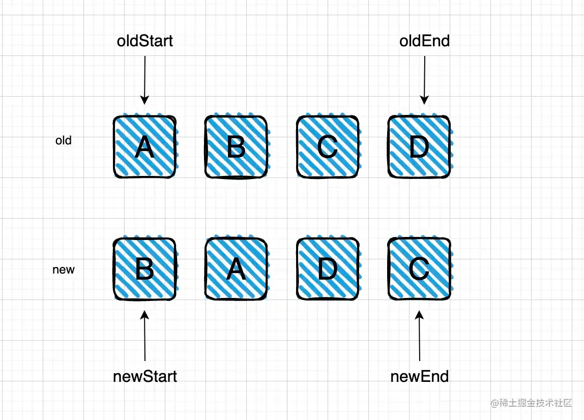
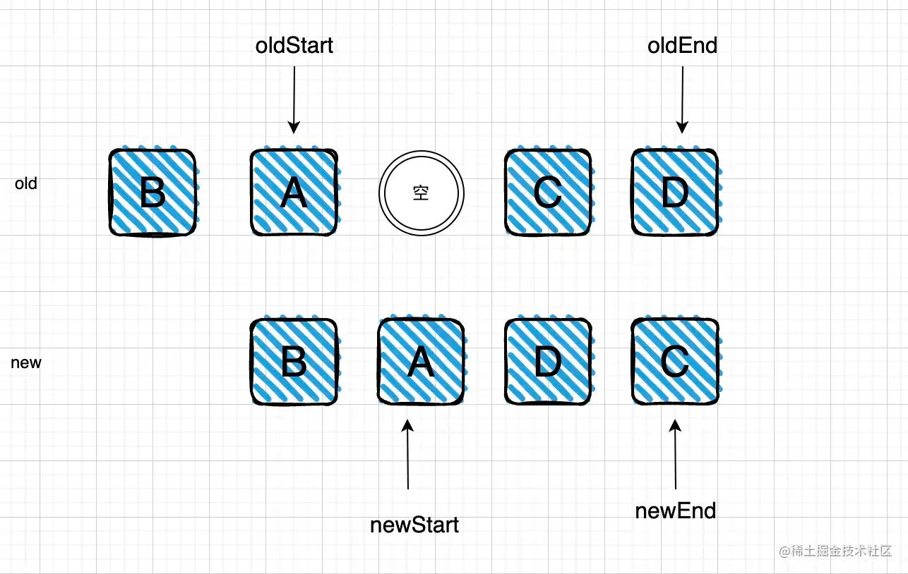
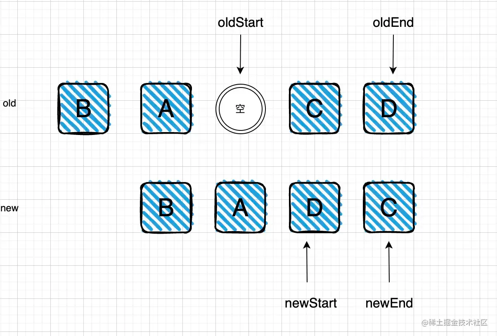
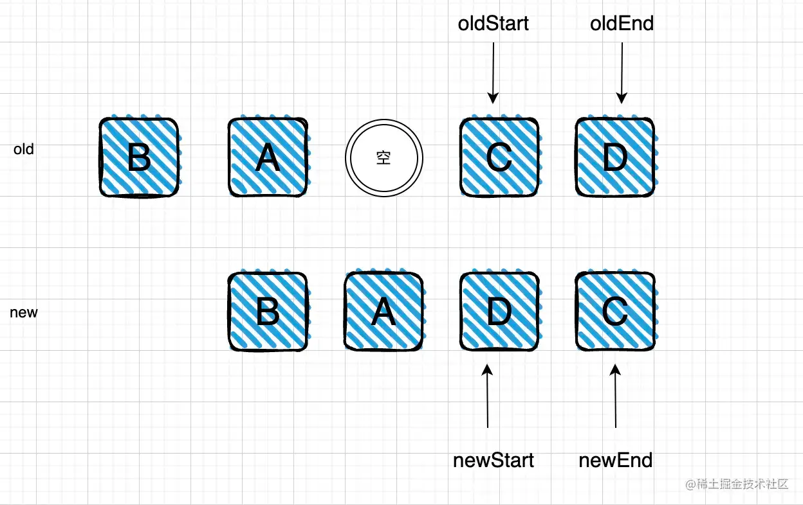
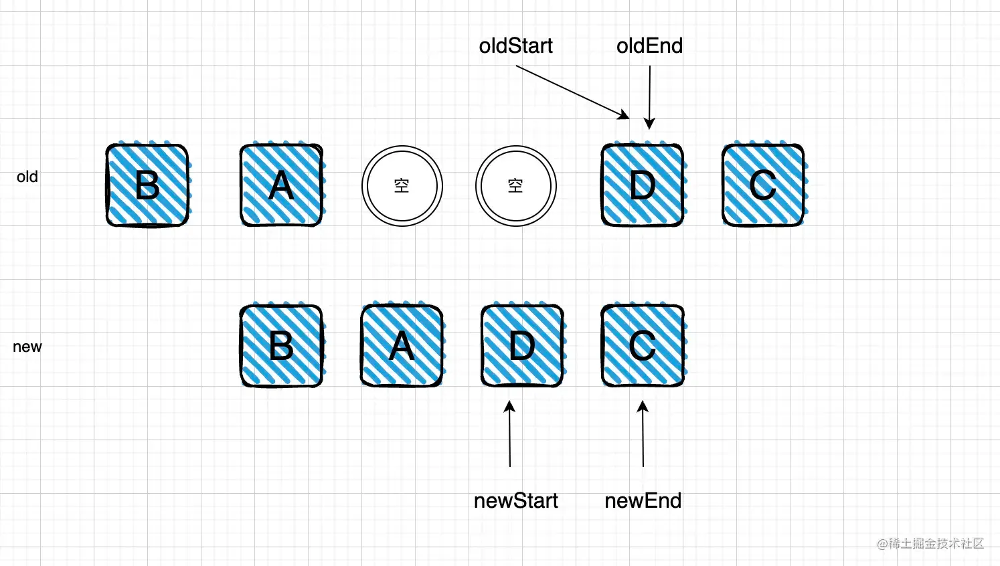
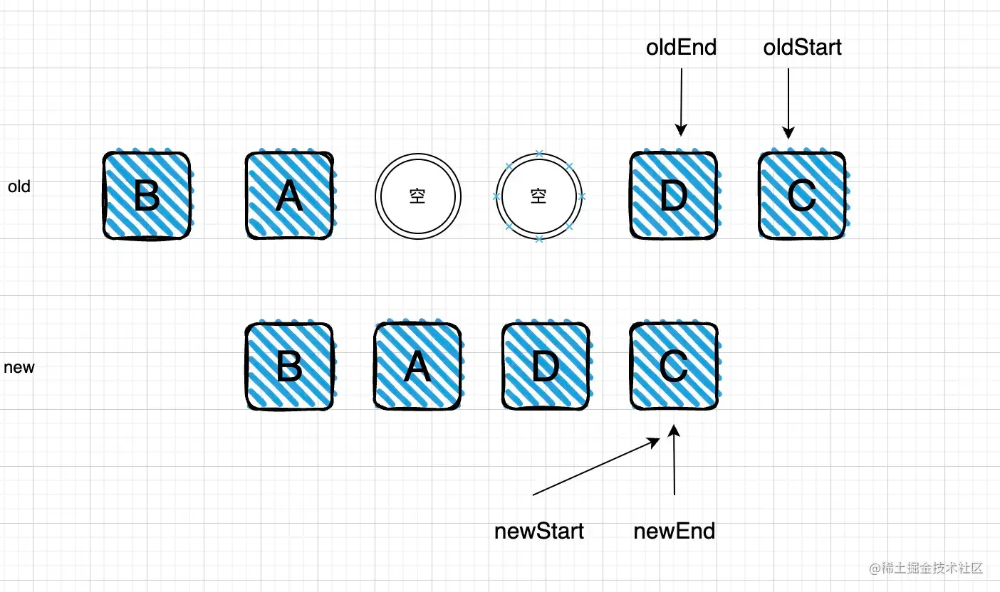

```
循环的条件就是 oldStart 不能大于oldEnd ，newStart不能大于newEnd

在每个循环单元中，我们执行下面的策略：

分支0：遇到空，指针向右移动

分支1：比较oldStart和newStart是否一致，如果一致，两个指针向右移动即可

分支2：比较oldEnd和newEnd是否一致，如果一致，两个指针向左移动即可

分支3：比较oldStart和newEnd是否一致，如果一致，就需要移动节点，移动节点都针对old的操作，因为需要将old变成新的，所以会慢慢调整old朝着new去拟合，将oldStart移动到oldEnd的下一个。

分支4：比较newStart和oldEnd是否一致，如果一致，就需要移动节点，将oldEnd移动到oldStart的前一个。

分支5：如果以上都没有命中，看看newStart是否在old中存在，如果存在，找到是第几个，假设是在old中的第i个位置，接下来将第i个位置的元素移动到oldStart的前一位，然后将当前第i位置空。如果不存在说明创建了一个新的元素，需要执行创建策略。

以上便是vue2的diff的核心流程了
```


```
old: A B C D

new: B A D C

初始化：oldStart指向A，oldEnd指向D，newStart指向B，newEnd指向C。

循环1:

第一步：A不等于B ，且D不等于C 未命中分支1和2第二步：A不等于C ，且B不等于D 未命中分支3和4第三步：自动进入分支5，newStart在old中是否存在，在vue2中是这样判断的：

//创建一个old的key和对应index的map表，在这个案例中就是：
const map = {
  A:0,
  B:1,
  C:2,
  D:3
}
newStart显然在map中存在，且index为1，所以根据策略，我们就需要将old中的第1位置的元素向oldStart的前一个移动，并且newStart向右移动。

第一轮循环结束：oldStart指向A，oldEnd指向D，newStart指向A，newEnd指向C

```

```
循环2:

第一步：判断 A 等于 A，命中分支1，指针都向右移动。

第二轮循环结束：oldStart指向空，oldEnd指向D，newStart指向D，newEnd指向C
```

```
循环3:

第一步：oldStart遇到空，命中分支0，指针向右移动，oldStart指向C。

第3轮循环结束；
```

```
循环4:

第一步：判断 D不等于C，并且C不等于D，未命中分支1分支2。第二步：判断 C等于C，命中分支3，将oldStart向oldEnd下一个移动，oldStart++。

第4轮循环结束：oldStart指向D，oldEnd指向D，newStart指向A，newEnd指向C。
```

```
循环5:

第一步：判断 D等于D ，命中分支1，指针向右移动，oldStart++。

第5轮循环结束：oldStart指向C，oldEnd指向D，newStart指向C，newEnd指向C。
```


```
这时候循环已经结束，因为oldStart已经大于oldEnd。

实际上，我们可以看到，old已经在相对次序上和new一模一样了，虽然在数据结构上有两个空在那里，而实际上的DOM结构已经移动到了正确的位置上，空对应在DOM上就是什么都没有，所以这个移动是正确的
```

```javascript

function updateChildren(
    parentElm,
    oldCh,
    newCh,
    insertedVnodeQueue,
    removeOnly
) {
    let oldStartIdx = 0
    let newStartIdx = 0
    let oldEndIdx = oldCh.length - 1
    let newEndIdx = newCh.length - 1
    let oldKeyToIdx, idxInOld, vnodeToMove, refElm
    while (oldStartIdx <= oldEndIdx && newStartIdx <= newEndIdx) { // 循环条件
      if (isUndef(oldStartVnode)) { // 排除空
        oldStartVnode = oldCh[++oldStartIdx] // 如果节点已经发生了移动会出现为undeifined的现象
      } else if (isUndef(oldEndVnode)) {// 排除空
        oldEndVnode = oldCh[--oldEndIdx]
      } else if (sameVnode(oldStartVnode, newStartVnode)) { // 分支1
        patchVnode(...) // 继续深度patch
        oldStartVnode = oldCh[++oldStartIdx]
        newStartVnode = newCh[++newStartIdx]
      } else if (sameVnode(oldEndVnode, newEndVnode)) { // 分支2
        patchVnode(...) // 继续深度patch
        oldEndVnode = oldCh[--oldEndIdx]
        newEndVnode = newCh[--newEndIdx]
      } else if (sameVnode(oldStartVnode, newEndVnode)) { // 分支3
        patchVnode(...)
        // 将oldStart对应的DOM移动到oldEnd对应DOM的下一个。
        nodeOps.insertBefore(
          parentElm,
          oldStartVnode.elm,
          nodeOps.nextSibling(oldEndVnode.elm)
        )
        ++oldStartIdx
        --newEndIdx
      } else if (sameVnode(oldEndVnode, newStartVnode)) { // 分支4
        patchVnode(...)
        // 将oldEnd对应的DOM移动到oldStart对应DOM的上一个。
        nodeOps.insertBefore(parentElm, oldEndVnode.elm, oldStartVnode.elm)
        --oldEndIdx
        ++newStartIdx
      } else {
        if (发现了新的节点) {
          createElm(...) // 创建一个DOM节点
        } else { 
          vnodeToMove = oldCh[idxInOld] // 找到在old中对应的位置
          if (sameVnode(vnodeToMove, newStartVnode)) {  // 分支5
            patchVnode(...)
            oldCh[idxInOld] = undefined // 置空
            // 将old所在位置的DOM移动到oldStart所在DOM的上一个。
            nodeOps.insertBefore(
              parentElm,
              vnodeToMove.elm,
              oldStartVnode.elm
            )
          } 
        }
        ++newStartIdx
      }
    }
  }
```