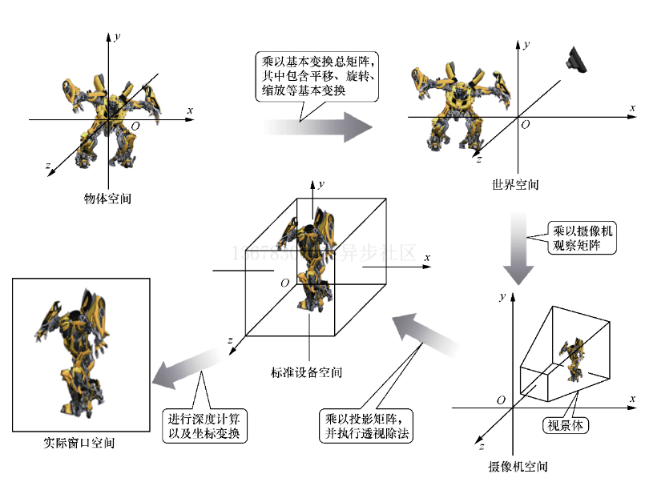

# WebGL 2.0采用的是三维笛卡儿坐标系
```
y轴平行于屏幕的竖边(上正下负)，
x轴平行于屏幕的横边(左负右正)，
z轴垂直于屏幕平面(外正里负)
```

# 空间
## 物体空间
绘制的3D物体所在的原始坐标系所代表的空间。例如在设计时，物体的几何中心是摆放到坐标系原点的，这个坐标系代表的就是物体空间。
## 世界空间
物体在最终3D场景中的摆放位置对应所属的坐标系的坐标代表的空间。比如，要在[10,3,5]位置摆放一个球，在[20,0,15]位置摆放一个圆锥，这里面[10,3,5]、[20,0,15]两组坐标所属的坐标系代表的就是世界空间。
## 相机空间
以观察场景的摄像机为原点的一个特定坐标系所代表的空间。在这个坐标系中，摄像机位于原点，视线沿z轴负方向，y轴方向与摄像机up向量方向一致;
在摄像机空间中，摄像机永远位于原点，视线一直沿z轴负方向，y轴一直沿摄像机up向量方向
## 剪裁空间
只有在视景体里面的物体才能最终被用户观察到。也就是说并不是摄像机空间中所有的物体都能最终被观察到，只有在摄像机空间中位于视景体内的物体才能最终被观察到。因此，将处于摄像机空间内视景体内的部分独立出来经过处理后就成为剪裁空间。
## 标准设备空间
对剪裁空间执行透视除法后得到的就是标准设备空间。对于WebGL 2.0而言，标准设备空间3个轴的坐标范围都是−1.0～1.0。
## 实际窗口空间
一般代表的是设备屏幕上的一块矩形区域，其坐标以像素为单位，也就是前面介绍过的视口对应的空间。
## 流程图
