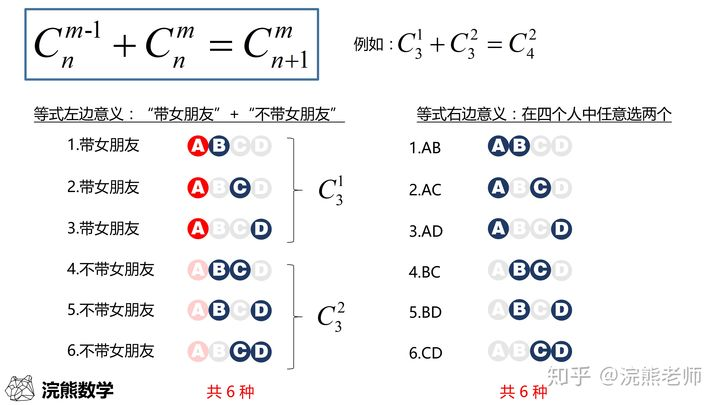

<center><strong>排列</strong></center>
-----

# 概念
```
排列的英文是 Permutation 或者 Arrangement，因此在数学符号中，用 P 或者 A表示都可以.
常见的 P 右边会跟两个数字（或字母），右下角的数字 n 表示总数，右上角的数字 m 表示抽出的个数。整个符号的意思是“从 n 个人中，有顺序地抽出 m 个人的抽法数”，可以读作“P n 抽 m”。
```

# 公式

```
记法是：从大的数字开始往小乘，乘“小的数字那么多”个
```

<center><strong>组合</strong></center>
---- 

# 概念
```
“组合”，它比排列更常用，组合的英文是 Combination，因此在数学符号中用 C 表示，美国和英国教材中，也常用“长括号”表示组合数。我们常见的 C 右边会跟两个数字（或字母），右下角的数字 n 表示总数，右上角的数字 m 表示抽出的个数。整个符号的意思是“从 n 个人中，不计顺序地抽出 m 个人的抽法数”，可以读作“C n 抽 m”
```

# 公式

```
公式记法: 组合数公式就是在排列数公式上除以一个 m！。即--从大的数字开始往小乘，乘“小的数字那么多”个，再除以“小的数字开始往小乘，乘小的数字那么多个
```

# 其他组合公式




